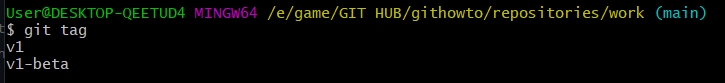
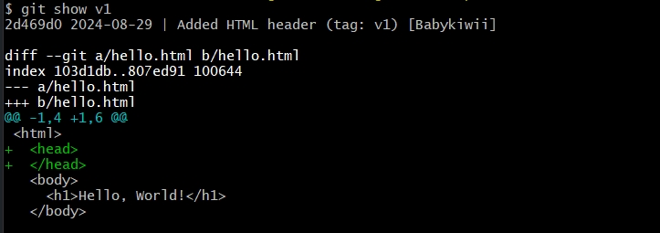
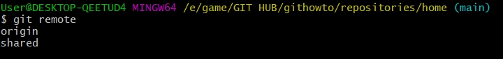
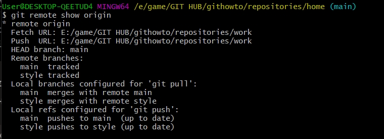

`Ярощук Александр Михайлович ИПЗ 4.04`
## Git

## Start

Для начала изменим конфиг в котором укажем как мы будем отображаться в изменениях в git.

```
git config --global user.name "Your Name"
git config --global user.email "your_email@whatever.com"
```

Так же можно указать чтобы по умолчанию, основная ветка называлась `main`

`git config --global init.defaultBranch main`

## Creating a project

Теперь можно начать, для начала создамим папку `work`.

Перейдем в нее и добавим файл `hello.html` в нем мы напишем:

`Hello, World!`

```
mkdir work
cd work
touch hello.html
```
С помощью команды `git init` мы можем создать репозиторий Git из этого каталога.

Теперь мы можем сохранить и добавить изменение в репозиторий, а именно что мы создали файл `hello.html`

```
git add hello.html
git commit -m "Initial Commit"
```


Используйте команду, чтобы проверить текущее состояние репозитория.
`git status`

Так же мы можем использовать `git commit` без аргументов, и у нас откроется текстовый редактор в котором мы можем указать комментарий на первой строке
Например:
`Added h1 tag`

У нас успешно сохранились изменения в git


Можем так же проверить изменения в репозитории.
`git log`


## Полезные команды для управления git
1. `git add .` для добавления всех файлов в `commit`.
2. `git log --oneline` однострочный формат `log`
3. C помощью этих команд можно задать стандартный формат для команды `git log`
```
git config --global format.pretty '%h %ad | %s%d [%an]'
git config --global log.date short
```


4. `git checkout <hash>` мы можем перейти на определеную версию репозитория.


5. Переход между ветками `git switch main` так же можно использовать чтобы вернуться на последнюю версию репозитория.
6. `git tag <nameTag>` можно создавать теги для версий, чтобы можно было обращаться по названию тегов а не по хешу.
`git checkout v1`
Например тут можно увидеть что версия имеет тег `tag: v1`

`2d469d0 2024-08-29 | Added HTML header (tag: v1) [Babykiwii]`


7. `git tag` можно увидеть все теги в репозитории.
   


8. `git log main --all` Проверить наличие тегов в журнале
9. `git reset HEAD hello.html` Команда сбрасывает промежуточную область в положение. Это освобождает промежуточную область от изменений, которые мы только что осуществили
10. `git revert HEAD` Чтобы отменить коммит, нам нужно создать коммит, который удаляет изменения, сохраненные нежелательным коммитом.
11. `git reset --hard v1` Сброс фиксации до v1
12. `git tag -d <nameTag>` Удаление тега
13. `git commit --amend -m "Added copyright statement with email"` С помощью аргумента `--amend` мы можем пересохранить уже существующий комит.
14. `git switch -c style` Чтобы создать ветку с названием `style`
15. `git show v1` Сравнение разных версий конкретного файла



16. `git log --all --graph`  Проверить наличие тегов в журнале c графиком
17. `git merge main` Обьеденение текущей ветки в `main`
18. `git merge --abort` Отмена обьеденение веток
19. `git clone work home` Клонирование репозитория `work` в папку `home`
20. `git remote`
    



